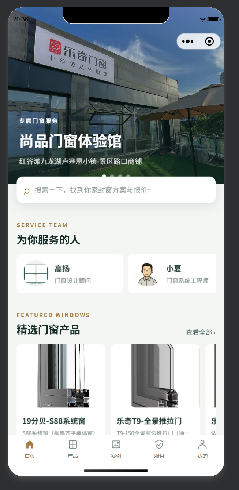
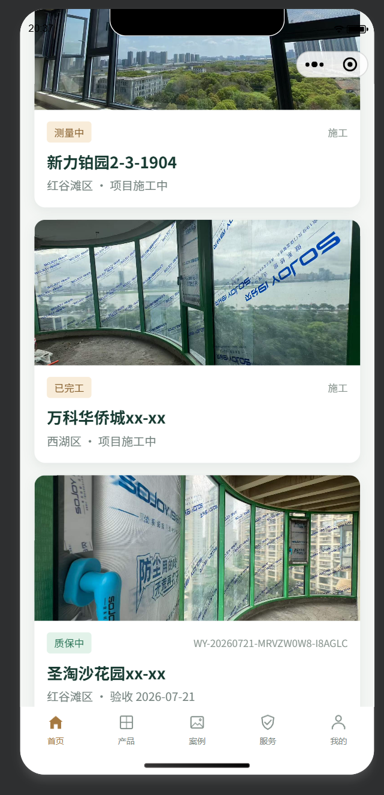
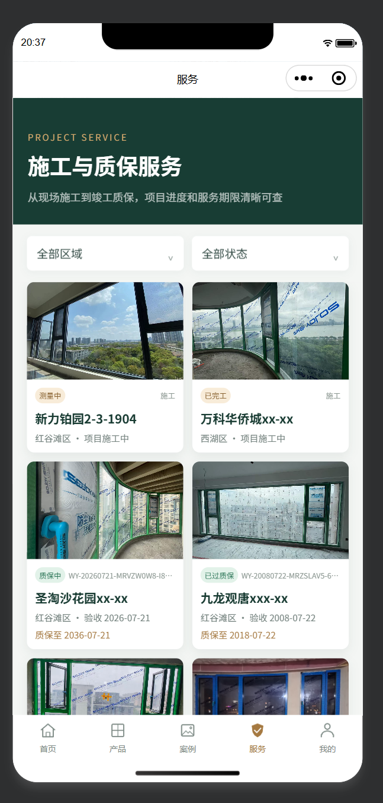
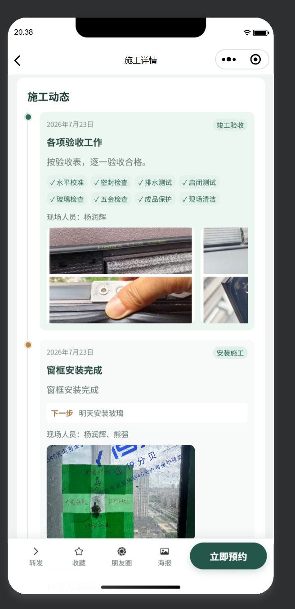

# WindoorsY 微信小程序

基于 uni-app、Vue 3 和 TypeScript 构建的门窗服务微信小程序，包含产品展示、施工案例、质保服务与预约咨询。

`WeChat Mini Program` · `uni-app` · `Vue 3` · `TypeScript` · `门窗服务` · `家装服务` · `预约咨询`

WindoorsY 是一个门窗服务平台微信小程序，面向用户提供门窗产品、服务案例、施工进度、质保服务和预约咨询等内容展示与联系能力。

## 功能范围

- 首页、产品、服务、案例和个人中心
- 产品、工地、服务人员和质保服务详情
- 产品、人员、案例和质保服务全局搜索
- 微信登录与登录状态处理
- 预约咨询、预约详情和预约结果
- 收藏、分享、小程序码和朋友圈分享
- 用户协议、隐私政策和微信隐私保护指引

## 演示效果

下面是当前演示页面的部分截图：

| 首页 | 施工与质保案例 |
| --- | --- |
|  |  |

| 施工与质保展示 | 工地施工流程管理 |
| --- | --- |
|  |  |

完整的静态演示页位于 [`demo/index.html`](demo/index.html)。

在本地查看交互演示：

1. 下载或克隆项目。
2. 用浏览器打开 `apps/miniprogram/demo/index.html`。
3. 如果浏览器限制本地 HTML 加载图片或脚本，可以在 `apps/miniprogram` 目录启动一个静态服务器后访问 `demo/index.html`：

   ```bash
   pnpm dlx serve .
   ```

GitHub 仓库页面会直接显示上面的截图；HTML 演示页本身需要在浏览器中打开，不能由 GitHub README 直接嵌入执行。

## 技术栈

- [uni-app](https://uniapp.dcloud.net.cn/)
- Vue 3
- TypeScript
- Vite
- [uni-ui](https://uniapp.dcloud.net.cn/component/uniui/uni-ui.html)
- [Wot Design Uni](https://wot-design-uni.cn/)
- Pinia
- 微信小程序平台

## 项目结构

```text
apps/miniprogram/
├── src/
│   ├── api/             # 后端接口调用
│   ├── components/      # 公共业务组件
│   ├── config/          # 前端配置与协议文案
│   ├── pages/           # 主导航页面
│   ├── pages-sub/       # 产品、工地、预约等子页面
│   ├── static/          # 图片和图标资源
│   ├── types/           # TypeScript 类型
│   └── uni_modules/     # uni-app 组件依赖
├── package.json
├── project.config.json
├── vite.config.ts
└── README.md
```

## 环境要求

- Node.js 18 或更高版本
- pnpm 9.15.0
- 微信开发者工具
- 可访问项目后端服务的 uniCloud 环境

项目使用 pnpm workspace 中的共享依赖，建议从仓库根目录安装依赖：

```bash
corepack enable
pnpm install
```

也可以进入当前目录后安装：

```bash
cd apps/miniprogram
pnpm install
```

## 开发与构建

在项目根目录运行：

```bash
pnpm --filter miniprogram dev:mp-weixin
```

构建微信小程序：

```bash
pnpm --filter miniprogram build:mp-weixin
```

构建产物默认位于项目的 `dist/` 目录。使用微信开发者工具打开对应的微信小程序构建目录进行预览和调试。

## 运行前准备

运行小程序需要同时具备以下条件：

1. 安装 Node.js 18 或更高版本、pnpm 9.15.0 和微信开发者工具。
2. 准备一个可用的 uniCloud 服务空间，并部署项目所需的云对象、云函数和数据库 Schema。
3. 确认前端接口配置指向你的服务环境。接口入口主要位于 `src/api/`，云对象调用和登录流程位于相关页面及 `uni_modules/uni-id-pages/`。
4. 使用自己的微信小程序 AppID 配置 `src/manifest.json` 和 `project.config.json`。AppSecret 只应配置在微信平台或服务端，不要写入前端代码。

本项目依赖后端返回门店、产品、工地、人员、质保和预约等数据。只有前端代码而没有对应后端服务时，可以完成编译，但登录、列表和提交预约等功能无法正常使用。

## 安装依赖

如果这是完整 monorepo 的 `apps/miniprogram` 子目录，建议在仓库根目录安装：

```bash
corepack enable
pnpm install
```

如果只下载了本目录及其依赖，也可以在当前目录执行：

```bash
cd apps/miniprogram
pnpm install
```

## 开发运行

在项目根目录运行微信小程序开发构建：

```bash
pnpm --filter miniprogram dev:mp-weixin
```

或者进入本目录后运行：

```bash
pnpm dev:mp-weixin
```

命令执行后，uni-app 会生成微信小程序开发目录。打开微信开发者工具，选择“导入项目”，导入生成的微信小程序目录，并使用与 `project.config.json` 一致的 AppID 进行预览。

## 构建发布

执行生产构建：

```bash
pnpm --filter miniprogram build:mp-weixin
```

或在当前目录执行：

```bash
pnpm build:mp-weixin
```

构建完成后，在微信开发者工具中导入构建输出目录，然后完成预览、上传和提交审核流程。

## 常见问题

### 页面显示为空或接口请求失败

检查 uniCloud 服务空间是否已部署，并确认云对象名称、数据库 Schema 和前端接口配置一致。

### 微信登录失败

检查 `src/manifest.json` 和 `project.config.json` 中的 AppID 是否为当前微信小程序 AppID，并确认服务端已经配置微信登录所需参数。

### 找不到构建命令

确认当前目录是 `apps/miniprogram`，或者在 monorepo 根目录使用 `pnpm --filter miniprogram ...` 命令。首次运行前先执行 `pnpm install`。

### 修改页面后没有生效

开发时使用 `dev:mp-weixin`，不要直接导入旧的 `dist/` 目录。重新构建后，再在微信开发者工具中刷新或重新导入项目。
