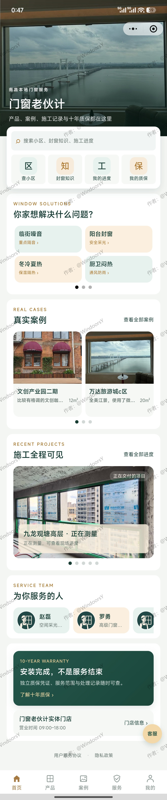
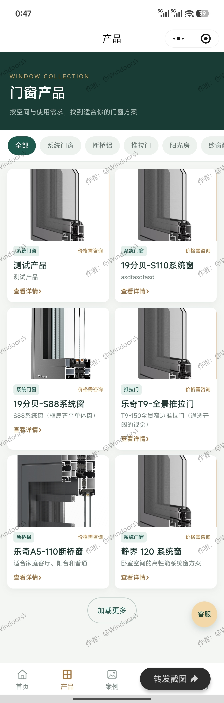
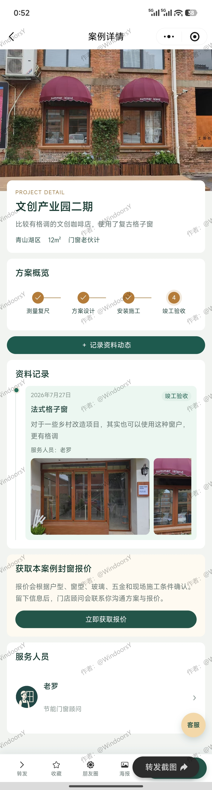
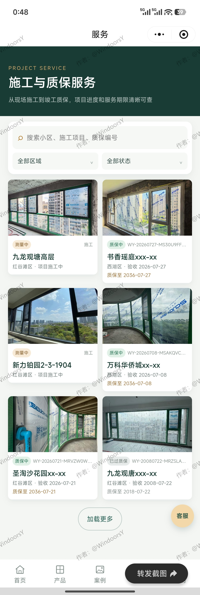

# 案例小助手 微信小程序

案例小助手（项目代号 WindoorsY）是一个门窗服务平台微信小程序，面向用户提供门窗产品、真实案例、施工进度、十年质保和预约咨询等内容展示与联系能力。

`WeChat Mini Program` · `uni-app` · `Vue 3` · `TypeScript` · `uniCloud`

## 功能范围

- 首页、产品、案例、服务和个人中心五项主导航
- 门窗产品、真实案例、施工项目、服务人员和质保凭证详情
- 产品、人员、案例和质保服务全局搜索
- 微信登录、登录状态处理和个人收藏
- 预约咨询、预约详情和预约结果
- 好友转发、朋友圈、海报和小程序码
- 用户协议、隐私政策和微信隐私保护指引

首版只提供内容展示、电话联系、微信登录和预约咨询，不开放第三方商户入驻，不提供在线交易、支付或配送。

## 演示效果

下面是当前小程序的部分真实页面：

| 首页 | 产品中心 |
| --- | --- |
|  |  |

| 案例详情 | 工地施工流程 |
| --- | --- |
|  |  |

[`/demo/`](demo/index.html) 是当前最新的 V2 静态演示：按“认识门店、选择产品、跟进施工、服务团队、十年质保”五个章节串联 18 个真实页面，支持截图内热点、前后切换、键盘操作、独立长图滚动和微信扫码入口。[`/demo/V1/`](demo/V1/index.html) 保留经典版演示，[`/demo/DevProgress/`](demo/DevProgress/index.html) 提供公开开发进度说明；三个页面入口互通。

在本地查看交互演示：

```powershell
cd apps/miniprogram
pnpm dlx serve .
```

然后访问 `http://localhost:3000/demo/index.html`。也可以直接用浏览器打开 `apps/miniprogram/demo/index.html`。

GitHub 和 Gitee 的仓库页面会直接显示上面的截图；交互演示需要在浏览器中单独打开。

## HBuilderX 本地演示

项目默认连接已关联的 uniCloud 服务空间。需要纯本地页面演示时，在未跟踪的
`.env.local` 中设置：

```dotenv
VITE_LOCAL_DEMO=true
```

本地演示模式不会调用云对象、云数据库或上传接口。删除该变量或设置为 `false` 后恢复
在线模式。

## 整体技术架构

项目采用 pnpm workspace 管理多个应用，共享类型位于 `packages/shared`。

### 微信小程序前端

- 目录：`apps/miniprogram/`
- 技术：uni-app、Vue 3、TypeScript、Vite、Pinia
- 组件：uni-app 基础组件、uni-ui、Wot Design Uni
- 平台：微信小程序
- 职责：面向客户展示门店、产品、案例、施工、质保和服务人员，并提供登录、收藏与预约咨询

### 管理后台前端

- 目录：`apps/admin/`
- 技术：uni-app H5、Vue 3、Vue Router、uni-ui
- 账号：uni-id / uni-id-pages
- 职责：管理门店、产品、工地、人员、施工动态、质保和预约

### uniCloud 后端

- 部署源：根目录 `uniCloud-aliyun/`
- 平台：uniCloud 阿里云
- 组成：云对象、云函数、数据库 Schema、权限规则和索引
- 职责：登录鉴权、公开内容查询、后台内容管理、预约、收藏和分享

小程序和管理后台主要通过 uniCloud 云对象访问后端。根 `uniCloud-aliyun/` 是代码审查与正式部署使用的源目录，不要只修改应用内部的本地映射或 vendored 副本。

### 共享代码

- 目录：`packages/shared/`
- 包名：`@windoors/shared`
- 职责：共享业务数据类型，减少各应用之间的数据结构偏差

## 环境要求

- Node.js 18 或更高版本
- Corepack
- pnpm 9.15.0
- 微信开发者工具
- HBuilderX（关联和部署 uniCloud 时使用）
- 已有且可用的 uniCloud 阿里云服务空间

## 小程序与管理后台如何运行

### 1. 安装依赖

在仓库根目录执行：

```powershell
corepack enable
pnpm install
```

项目使用 workspace 依赖，建议始终从仓库根目录安装，不要在各应用中混用 npm 或生成额外的 `package-lock.json`。

### 2. 准备 uniCloud 后端

本项目不是只有前端即可完整运行。登录、内容列表、收藏和预约等功能依赖 uniCloud。

1. 使用 HBuilderX 关联一个已有的 uniCloud 阿里云服务空间。
2. 以根 `uniCloud-aliyun/` 为部署源，按需上传数据库 Schema、云对象和云函数。
3. 确认门店、产品、工地、人员、施工动态、预约和质保等集合已经初始化。
4. 配置微信登录所需参数时，只在微信平台或服务端保存 AppSecret，不要写入仓库、前端代码或聊天记录。

不要重新创建正式服务空间，不要清空云数据库，也不要在已有正式数据的空间重复导入演示数据。具体部署顺序以 `docs/deployment/` 和 `docs/handoff/current-development-status.md` 为准。

### 3. 运行微信小程序

在仓库根目录启动开发构建：

```powershell
pnpm --filter miniprogram dev:mp-weixin
```

生产构建：

```powershell
pnpm --filter miniprogram build:mp-weixin
```

构建后，使用微信开发者工具导入小程序输出目录，并确认 AppID 与 `apps/miniprogram/project.config.json`、`src/manifest.json` 一致。

### 4. 运行管理后台

开发模式：

```powershell
pnpm --filter admin dev
```

生产构建：

```powershell
pnpm --filter admin build
```

后台以 H5 方式运行，需要正确关联 uniCloud 服务空间并具备受控的管理员账号。真实本地环境配置应保存在被 Git 忽略的 `.env.local` 中。

## 小程序目录说明

```text
apps/miniprogram/
├── demo/               # 纯静态交互演示
├── src/
│   ├── api/            # 后端接口调用
│   ├── components/     # 公共业务组件
│   ├── config/         # 前端配置与协议文案
│   ├── pages/          # 主导航页面
│   ├── pages-sub/      # 产品、工地、预约等子页面
│   ├── static/         # 图片和图标资源
│   ├── types/          # TypeScript 类型
│   └── uni_modules/    # uni-app 组件依赖
├── package.json
├── project.config.json
├── vite.config.ts
└── README.md
```

## 常见问题

### 页面显示为空或接口请求失败

检查 uniCloud 服务空间是否已关联和部署，并确认云对象名称、数据库 Schema、权限规则与前端调用一致。

### 微信登录失败

检查 `src/manifest.json` 和 `project.config.json` 中的 AppID 是否一致，并确认服务端已经配置微信登录所需参数。

### 找不到构建命令

确认已经在仓库根目录执行 `pnpm install`，并使用 `pnpm --filter miniprogram ...` 或 `pnpm --filter admin ...`。

### 修改小程序页面后没有生效

开发时使用 `dev:mp-weixin` 重新构建，不要继续导入旧的 `dist/` 目录。构建后在微信开发者工具中刷新或重新导入输出目录。

## 技术交流

如需就本项目的架构设计、uni-app、uniCloud 或部署实践进行技术交流，可通过用户名 `@WindoorsY` 联系。请在交流时说明具体技术问题、运行环境与复现步骤。
